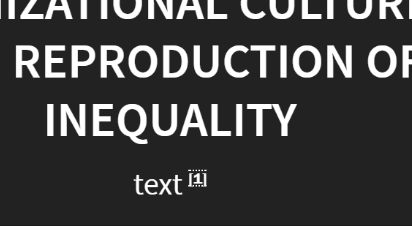

## Blank Template for Lem's presentations

## Why?

A feature rich and accessible presentation package, if not for presenting, can bu useful as learning tool. I think. I might, you don't know. 
It's mainly a way to avoid doing the work I actually need to be doing, i.e. creating the actual content of these presentations. Very useful for that. Yep.

## How?

<!--1. Copy to a new folder-->
<!--1. `git init`-->
1. Clone
1. `npm install`
3. `grunt` (Check if the modified `marked.js` file hasn't changed)
3. Remove `./Pictures/` content
4. Replace this `README.md` file
3. The presentation itself goes into `./main.md`
4. `grunt serve`

### Bib:
1. Create a `.bib` file to replace `./bib.bib`
2. Upload the `.bib` file to the repo
2. Use [bibbase](https://bibbase.org) to create a rendered bibliography 
3. Replace the `script src=` in `./bib.html`

---

## Lem's sprinkles

#### Slide Separators:

Vertical: `---` <br>
Horizontal: `--` <br>

Notes: `VVV`

#### Footnotes:


`{`citation text, in any form, with URL automatically linked and truncated. `p.№` or `pp.№-№` `|` `№` <Citation number - not essential and automatically replaced with imdex number `}`

▼

[№] 

#### Blockquote:

```markdown
<blockquote>
quote
</blockquote>
```
#### Non-printable slides:

Start the slide with:
  
```markdown
<!--.slide: class="no-print"-->
```

---

## To Do:

* Proper title case in titles (Ignore articles, conjunctions, and prepositions)
* Improve citation 
    * Relocate the citation itself to a separate file 
    * Use citation-js to format the citations correctly and automatically
    * Automatic short-cite and ibid.
    * Automatic Bibliography instead of using BibBase 
    * Transform tooltips into footnotes in print-pdf mode
* Package alongside editor-tools and scripts to ease beginners' use
    * paste-image 
    * parse pasted URLs
    * Easy local-server setup and better gh-pages upload guide
* Add RTL mode 
* Replace HTML literals with easier syntax (Blockquote, txt-overlay, slide-bg, etc')
* Visual 
    * Improve design and readability when using pictures (Preprocess and extract main colors?)
    * Ken Burns effect
    * Find a good way to embed leafly maps into presentations
    * News-style newspaper highlighting 

* Vague dreams 
    * mapinseconds or similar simple csv-to-map tool
    * timelines
    * dedicated sub sections, for characters, events, terms, etc. 
          * Wiki-like inner linking to those relevant sections 
* Implement markdeep, or at least automatic svg from ascii 
* Ability for live editing during presentation, perhaps even from the speaker screen itself. If this tool can be useful for teaching purposes, this'll be a great addition. 
* proper export to manageable off line copy. Might be harder than even the previous ideas, but a worthy cause.